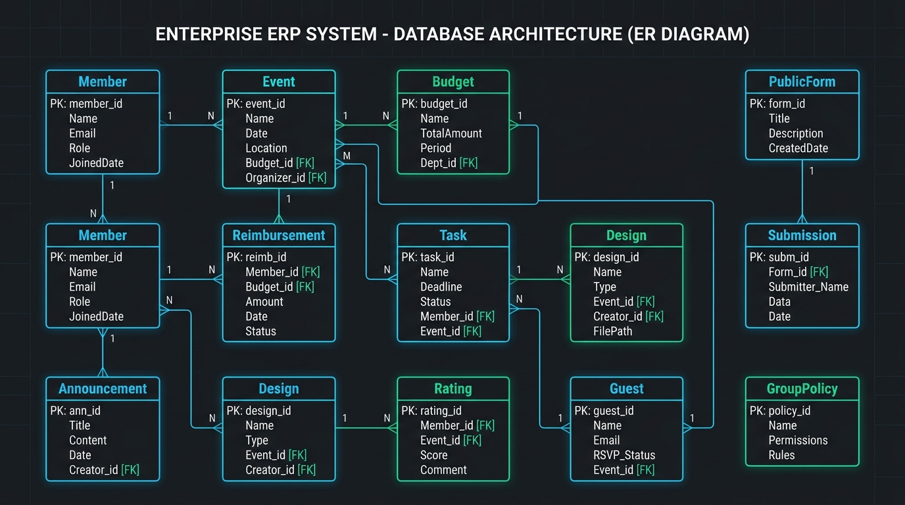
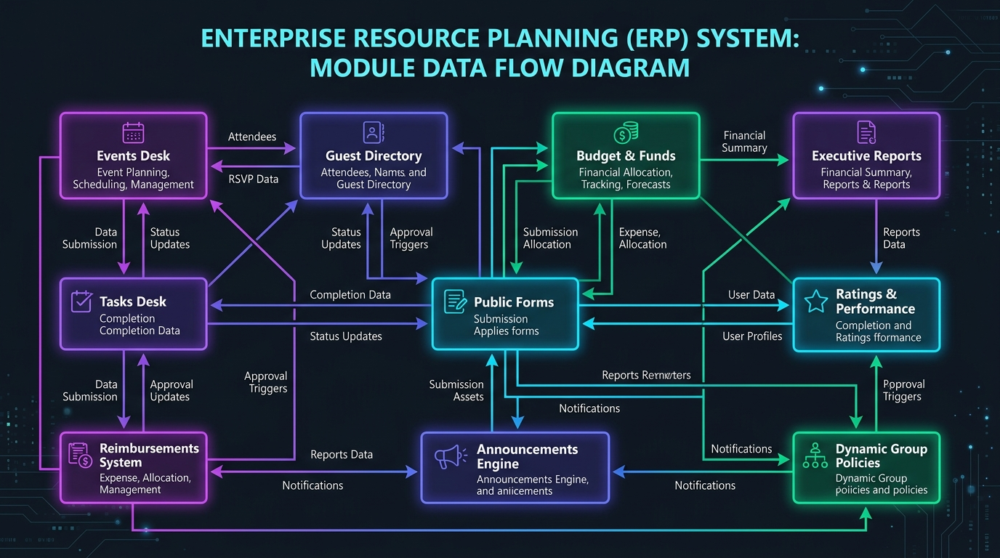
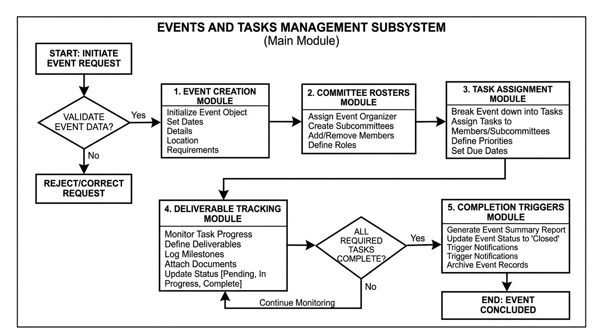

# LEADS Next Gen All-in-One Dashboard

**Private internal operations and management ERP for the LEADS Next Gen Centre at M.S. Ramaiah University of Applied Sciences (MSRUAS), Bengaluru.**

This platform replaces a scattered mix of WhatsApp groups, spreadsheets, and email threads with a single, role-gated portal covering task traceability, event lifecycle management, multi-reviewer performance evaluation, two-stage reimbursement pipelines, dynamic public form building, financial governance, digital visiting cards & Apple/Google wallet passes, event access passes with QR gate scanning, and full member/guest roster management for roughly 140 people across 7 access tiers.

> This is a **private** repository and application. It is not a public product — access is restricted to LEADS Next Gen Centre members and MSRUAS staff.

---

## Table of Contents

- [Recent Updates](#-recent-updates)
- [Project Structure](#-project-structure)
- [Tech Stack](#-tech-stack)
- [Getting Started](#-getting-started--first-time-setup)
- [One-Time Initial Setup Wizard](#-one-time-initial-setup-wizard)
- [Environment Variables](#-environment-variables)
- [Module Breakdown](#-module-breakdown)
  - [1. Dashboard Home](#1-dashboard-home-dashboardhome)
  - [2. Calendar Module](#2-calendar-module-dashboardcalendar)
  - [3. Events Desk](#3-events-desk-dashboardevents)
  - [4. Tasks Desk](#4-tasks-desk-dashboardtasks)
  - [5. Ratings & Student Performance](#5-ratings--student-performance-dashboardratings)
  - [6. Approvals & Governance Desk](#6-approvals--governance-desk-dashboardapprovals)
  - [7. Design Portal](#7-design-portal-dashboarddesigns)
  - [8. Event Passes & Gate QR Scanner](#8-event-passes--gate-qr-scanner-dashboardevent-passes)
  - [9. Digital Visiting Card & Wallet Passes](#9-digital-visiting-card--wallet-passes-dashboardvisiting-card--cardslug)
  - [10. Reimbursements System](#10-reimbursements-system-dashboardreimbursements)
  - [11. Budget & Funds](#11-budget--funds-dashboardbudget)
  - [12. Public Forms Builder](#12-public-forms-builder-dashboardforms--formsslug)
  - [13. Analytics & Reports](#13-analytics--reports-dashboardreports)
  - [14. Announcements Engine](#14-announcements-engine-dashboardannouncements)
  - [15. Member Directory & Roster](#15-member-directory--roster-dashboarddirectory)
  - [16. Guest Directory](#16-guest-directory-dashboardguest-directory)
  - [17. Guest Invites Dispatcher](#17-guest-invites-dispatcher-dashboardguest-invites)
  - [18. Dynamic Group Policies](#18-dynamic-group-policies-dashboardpolicies)
  - [19. Backup & Restore](#19-backup--restore-dashboardbackup)
  - [20. Email Management & Client](#20-email-management--client-dashboardemail)
  - [21. System & Account Settings](#21-system--account-settings-dashboardsettings)
- [Access Level Tiers & Privileges Matrix](#-access-level-tiers--privileges-matrix)
- [Super User Features](#-super-user-features)
- [Production Deployment (AWS EC2)](#️-production-deployment-aws-ec2)
- [Data Persistence & Encryption](#-data-persistence--encryption)
- [System Architecture & Engineering Diagrams](#-system-architecture--engineering-diagrams)
- [UI Aesthetics & Mobile Design](#-ui-aesthetics--mobile-design)
- [Comprehensive Operations Manual](#-comprehensive-operations-manual)
- [Intellectual Property & Licensing Notice](#️-intellectual-property--licensing-notice)

---

## 🆕 Recent Updates

Everything that's changed since this README was last updated (2026-09-15). Full detail is in the git history (`git log`); this is the summary.

### Infrastructure — moved to AWS
- **Migrated production hosting from a Hostinger KVM VPS to AWS EC2** (region `ap-south-1`), now served at **`portal-leads.msruas.ac.in`** through an AWS Application Load Balancer, administered via AWS Systems Manager Session Manager instead of direct SSH. See [Production Deployment (AWS EC2)](#️-production-deployment-aws-ec2) below.
- Fixed a bug left over from that migration: several places (wallet pass logo/photo URLs, background-worker email links) were still hardcoded to the old `leadsnextgencentre.online` domain — a completely different, stale deployment — instead of the real live domain. This was the root cause of Apple/Google Wallet passes silently failing to generate.

### 2026-09-22
- **Members Directory**: add/remove access hard-locked to Centre Head, Advisor, and Super User — no longer delegable via Group Policy (#129, #134); new **Faculty Ambassador** (#132) and **Chief Advisor**, view-only (#133) designations; new **"Pending Activation / Reset"** filter tab (#139); member names auto-capitalize as typed (#128); "Present Credentials" 3D keycard now opens on the closed cover instead of skipping the animation (#127).
- **Digital Visiting Card / Wallet Passes**: fixed the "Configured" status badge never showing (#126), fixed the stale-domain bug that broke wallet pass generation entirely (#131), and wallet pass failures now surface the real error instead of failing silently (#130).
- **Promotion/demotion notice**: a tier change now pops up a notice either direction — promotion keeps its celebratory copy, a tier increase (demotion) now shows a matching notice instead of nothing (#134).
- **Mail Merge** (renamed from "Guest Invites", internals unchanged) and **Email Management**: both composers can now attach files (15MB cap) with a one-click attachment-note helper (#135).
- **Events**: new events start with zero pre-seeded committees instead of 3 auto-created defaults (#136).
- **Design Portal**: fixed design-brief tasks assigned to a committee never showing up in the "Design Task Requests" queue for that committee's members (#137).
- **Task assignment emails**: fixed automatically-created tasks (the weekly holiday social-media approval task, the daily event-lapse social-media task) never sending their assignee an email at all — they bypassed the normal task-creation email pipeline entirely (#138).

### 2026-09-21
- Dashboard Home: stat cards (Active Events, Assigned Tasks, Member Roster, Performance Rollup) are now clickable deep links into their module; Assigned Tasks card shows completed vs. pending separately; Performance Rollup gets a breakdown tooltip; added a "Last updated" timestamp.
- Project Timeline (Gantt): wider sticky label column, single-click row interaction instead of two-click inspect-then-open.
- Members Directory: fixed the profile-view close button doing nothing for restricted-access members.

### 2026-09-15
- Ratings: Task Evaluation Queue now shows pending items and groups scorecards with aggregate scores; Advisor granted edit/delete permissions; averaged ratings per deliverable added to the Reports page.
- Email: fixed deep-link navigation, post-login target URL preservation, and activity highlighting.
- Members Directory: fixed modal close-button issues, added backdrop-click-to-close and an Escape key listener.
- Design Portal: excluded a specific proofreader, restricted the proofreader pool to Centre Head / Advisor / Social Media Heads with Centre Head & Advisor auto-selected by default.
- Digital Visiting Card: fixed mobile overflow/cut-off in the 3D luxury leather bookfold view.

---

## 📂 Project Structure

```
ERP/
├── leads-dashboard/        # Next.js 16 (App Router) + TypeScript + Tailwind CSS v4 — the live application
│   ├── src/app/             # App Router routes: dashboard pages, public form pages, and the api/ backend
│   ├── src/components/      # Shared React components (ImageCropModal, EmptyState, Shell, etc.)
│   ├── src/lib/              # Permissions engine, email service, encryption, data access layer
│   ├── scripts/              # setup-superuser.js, decrypt-backup.js
│   └── public/                # Static assets (logos, reference images)
├── PROJECT DOCS/            # Product specifications: PRD, sitemap, design system, tech spec, data model (ERD)
├── REFERENCE DATA/          # Official MSRUAS leadership directory, hierarchy structure, source images
├── docs/                     # Engineering manuals, deployment guides, DB/module diagrams, Operations Manual (DOCX)
├── demo/                     # Static demo page
├── scripts/                  # Repo-level helper scripts
└── deploy.sh                 # Deployment helper script
```

---

## 🛠️ Tech Stack

| Layer | Technology |
| :--- | :--- |
| **Framework** | [Next.js 16](https://nextjs.org) (Turbopack, App Router) & [React 19](https://react.dev) |
| **Language** | [TypeScript 5](https://www.typescriptlang.org) (strict mode) |
| **Styling** | [Tailwind CSS v4](https://tailwindcss.com) with custom glassmorphism design system |
| **Icons** | [Lucide React](https://lucide.dev) |
| **Cryptography** | Node.js `crypto` — `scrypt` (password hashing), `AES-256-GCM` (data-at-rest encryption), `PBKDF2` |
| **Charts & Visualization** | [Recharts](https://recharts.org) |
| **PDF & QR Engines** | `jspdf`, `jspdf-autotable`, `qrcode`, `html2canvas`, `jsqr` |
| **Wallet Passes** | Native Apple Wallet (`.pkpass`), Google Wallet Pass API integration |
| **Image Processing & Cropping** | Canvas-based multi-ratio image crop engine with zoom and pan |
| **Document Export** | `jszip`, `adm-zip`, `archiver` (Word DOCX / ZIP report generation) |
| **OCR & Spellcheck** | `tesseract.js`, `nspell`, `dictionary-en` / `dictionary-en-gb` |
| **Email Relay** | `nodemailer`, routed through a local Postfix relay |
| **Sanitization** | `isomorphic-dompurify` |

---

## 🚀 Getting Started & First-Time Setup

### Prerequisites

- Node.js 20+ and npm
- Git

### 1. Clone & Install

```bash
git clone <repository-url>
cd ERP/leads-dashboard

npm install
```

### 2. Configure Environment Variables

Copy the example environment file and fill in your SMTP relay details:

```bash
cp .env.example .env
```

### 3. Run the Development Server

```bash
npm run dev
```

Open [http://localhost:3030](http://localhost:3030) in your browser (configured for port `3030`).

### Available Scripts

| Command | Description |
| :--- | :--- |
| `npm run dev` | Start the Next.js development server (Turbopack) on port 3030 |
| `npm run build` | Build the production bundle |
| `npm run start` | Start the production server on port 3030 |
| `npm run lint` | Run ESLint |
| `npm run setup` | Run the CLI Super User bootstrap script (`scripts/setup-superuser.js`) |
| `npx tsc --noEmit` | Run a TypeScript compilation check without emitting output |

---

## 🪄 One-Time Initial Setup Wizard

On a fresh installation (locally or on a production VPS), the application automatically detects that no accounts exist and enters the **One-Time Initial Setup Wizard**:

1. **Step 1: Super User Account Provisioning**
   - Enter the root Super User's Full Name, Email Address, and Master Password (min 8 characters).
   - The password is cryptographically hashed using **scrypt** with a random per-user salt.
   - The instance starts clean with **zero hardcoded members**.
2. **Step 2: Database Server-Side Encryption Key (`DATA_ENCRYPTION_KEY`)**
   - Automatically generate a cryptographically strong 256-bit hexadecimal key (or enter a custom passphrase).
   - The key is saved permanently to `.env` on the server and used to encrypt all local database collections via **AES-256-GCM**.
   - A backup alert reminds the operator to store this key in a secure offline password manager.

> **Permanent Lock:** Once the initial setup is completed, the wizard is permanently locked. Future visitors to `/` or `/setup` are taken straight to the normal Sign-In portal.

---

## 🔑 Environment Variables

Configuration lives in `leads-dashboard/.env`:

| Variable | Description |
| :--- | :--- |
| `DATA_ENCRYPTION_KEY` | 256-bit hex key used for AES-256-GCM encryption of all local database collections. Auto-generated by setup wizard. |
| `SMTP_HOST` / `SMTP_PORT` | Local Postfix submission target (defaults to `localhost:25`). |
| `ANNOUNCEMENT_FROM_EMAIL` | Sender address for outbound mail. Must match authenticated relay user. |
| `ANNOUNCEMENT_FROM_NAME` | Display name used on outbound institutional email. |
| `WALLETWALLET_API_KEY` | (Optional) API key for automated Apple & Google Wallet pass issuance. |

---

## 📦 Module Breakdown

### Workspace & Operational Modules

#### 1. Dashboard Home (`/dashboard/home`)
- **Executive Overview**: Centralized operations desk featuring friendly greetings, designation breakdowns, active task counters, upcoming event schedules, and recent announcements.
- **Cross-Module Project Timeline (Gantt)**: One bar per event spanning its start/end dates (colored by status), with diamond markers for tasks plotted at their due date, plus an "Other Deliverables" row. Interactive window toggle (2-Weeks / 30-Days / 90-Days) with auto-widening fallback and lead-in planning phase indicators.
- **Quick Action Hub**: Shortcuts for event creation, task assignment, design uploads, and announcement broadcasting.
- **Personal Deliverables**: Dedicated widget showing items assigned to the current user.

#### 2. Calendar Module (`/dashboard/calendar`)
- **Inter-Campus Operational Timeline**: Interactive calendar displaying event schedules, sub-committee milestones, and university deadlines.
- **Planning-Phase Markers**: Distinct amber indicator for pre-event planning windows (Planning Start Date up to actual Start Date).
- **Campus Filtering**: Filter view by **GG Campus**, **RTC Campus**, or **All Campuses**.
- **Event Highlights**: Clickable event cards showing dates, venue details, committee leads, and status badges.

#### 3. Events Desk (`/dashboard/events`)
- **Lifecycle Management**: End-to-end event workflow: *Draft* → *Pending Approval* → *Published* → *Completed*.
- **Planning Start Date vs. Event Date**: Supports a separate planning start date so prep work is tracked without misrepresenting live dates.
- **Status Filter Tabs**: Filter by *All Events*, *Ongoing*, *Completed*, or *Archived*.
- **Sub-Committee Formation**: Create specialized committees (Logistics, Technical, Media, Operations) with assigned members.
- **Bulk Roster Import**: Download CSV template and bulk-upload events.
- **Approval Engine**: Executive Council event creations trigger Centre Head sign-off requirements.
- **Festivals & Observances**: Synced national holidays require explicit social media post sign-off (`holiday_social_approval`) before appearing in selection dropdowns.
- **No Default Committees**: New events start with zero sub-committees — the 3 auto-seeded defaults (Logistics & Venue, Technical & AV, Design & Media) were removed; committees are still fully supported, just no longer pre-created.

#### 4. Tasks Desk (`/dashboard/tasks`)
- **Task Delegation**: Assign tasks to individual members or entire sub-committees with priority tagging (*Urgent*, *High*, *Normal*, *Low*).
- **Searchable Combobox Filters**: Type-to-search assignee and event filter dropdowns.
- **Status Tracking**: Visual progress pipeline: *To Do* → *In Progress* → *Under Review* → *Completed*.
- **Auto-Generated Design Tasks**: Finalized Design Portal submissions automatically create or complete tasks.
- **Extension Requests**: Assignees can request deadline extensions subject to Advisor or Centre Head approval.

#### 5. Ratings & Student Performance (`/dashboard/ratings`)
- **Multi-Reviewer Independent Rubric**: 4-way independent leadership evaluation rubric (**Super User**, **Centre Head**, **Advisor**, and **GG Campus Events Head**).
- **Live Aggregate Averaging**: Reviews submitted by any panel member automatically compute into a live composite average score.
- **Design Evaluation Lane**: Dedicated evaluation slot for the Design Head on creative deliverables.
- **Searchable Combobox Filters**: Quick search filters for students and events with custom monthly or date-range filtering.

#### 6. Approvals & Governance Desk (`/dashboard/approvals`)
- **Centralized Approvals Inbox**: Dedicated management hub for pending sign-offs across **Announcements**, **Tasks**, **Events**, **Designs**, **Event Reports**, **Members**, and **Committees**.
- **In-Card Rich Overview Previews**: Each card includes an immediate preview snippet (announcement scope & message body, task brief & due date, event dates & venue, design thumbnail & category, report file specs).
- **Interactive Deep Overview Modal**: One-click modal inspection showing un-truncated content bodies, attachments, requester messages, and embedded **Approve / Reject** buttons with optional decision notes.
- **Multi-Panel Auto-Sync**: Sibling requests for Centre Head, Advisor, and GG Events Head automatically resolve when any panel member decides, with standing Super User override authority.

#### 7. Design Portal (`/dashboard/designs`)
- **Asset Review Desk**: Dedicated portal for Design and Social Media department asset requests, proofreading, and approval workflows.
- **Dual Review Pipeline**:
  - *Proofreading Gate*: Assign proofreaders with change requests or plain approval.
  - *Style Approval Gate*: Final Design Head / Centre Head sign-off.
- **Asset Management**: File uploads with image previews, OCR text scanning, and automated completed task synchronization.
- **Design Task Requests Queue**: Design-brief Tasks (Tasks module, `taskCategory: 'design'`) awaiting a submission surface here for whoever they're assigned to — correctly resolving committee assignment (not just individual/group) via the linked event's committee membership.

#### 8. Event Passes & Gate QR Scanner (`/dashboard/event-passes`)
- **Digital Event Passes**: High-resolution event pass cards with unique serial numbers, security QR codes, and automated email dispatch with pass attachments.
- **Gate QR Scanner**: Integrated in-app camera scanner for event security and coordinators with authenticated instant validation.
- **Pass Governance**: Re-send pass emails, revoke invalid passes, or delete records.

#### 9. Digital Visiting Card & Wallet Passes (`/dashboard/visiting-card` & `/card/[slug]`)
- **Public Visiting Card**: Dynamic `/card/[slug]` landing page featuring member profile, designation, direct phone/LinkedIn links, and instant VCF vCard download.
- **Interactive Image Cropper**: Multi-aspect ratio image cropping modal with zoom, pan, and centering controls for avatars and visiting cards.
- **Apple & Google Wallet Passes**: Automated wallet pass generation via WalletWallet API with QR codes, caching, and rate-limited regeneration (2 per 15-day window). The image URLs sent to WalletWallet now point at the live production domain (`portal-leads.msruas.ac.in`) instead of a stale domain from before the AWS migration; generation failures also now surface the real error on the Save & Publish toast instead of failing silently.
- **3D Leather Keycard ("Present Credentials")**: Mobile overflow/cut-off in the 3D bookfold view fixed; opens on the closed leather cover (tap-to-open animation) rather than jumping straight to the extracted card.

---

### Administration & Governance Modules

#### 10. Reimbursements System (`/dashboard/reimbursements`)
- **Expense Claims**: Expense submission desk with receipt proof attachments and amount validation.
- **Two-Stage Approval Pipeline**:
  - **Stage 1 (Sector Head)**: Initial operational verification.
  - **Stage 2 (Finance Head)**: Final financial audit and reimbursement sign-off.

#### 11. Budget & Funds (`/dashboard/budget`)
- **Financial Governance**: Ledger for university fund allocations, department budgets, and operational expenditures.
- **Smart Sponsorship Calculation Engine**:
  - *Sponsor Depletion First*: Event expenses deplete sponsor funds before touching the Centre's allocation.
  - *Sponsor Surplus Return Rule*: Unused event sponsorship returns to the Centre's main account.
  - *Total Available Capital*: Real-time formula: `Annual Approved Budget + General Income/Grants + Returned Sponsor Surplus`.
- **Multi-Year Budgeting Engine**: Extended 9-year Financial Year selector (`-5` years back to `+3` years forward).

#### 12. Public Forms Builder (`/dashboard/forms` & `/forms/[slug]`)
- **Interactive Form Builder**: Custom form engine for student signups, feedback collection, and event registrations.
- **Instant QR Code & Poster Download**: Generates high-res printable poster PNG cards with branding header and scannable QR code.
- **Official Word (DOCX) Export**: Built-in Feedback Form template generates field-for-field filled copies matching `Feedback_Events.docx`.

#### 13. Analytics & Reports (`/dashboard/reports`)
- **Executive Report Generator**: Styled PDF report generation and CSV data exports for scorecards, event post-mortems, and financial audits.

#### 14. Announcements Engine (`/dashboard/announcements`)
- **Targeted Broadcasting**: Multi-scope broadcasting (`ALL_MEMBERS`, `CORE_COMMITTEE`, `DEPARTMENTS`, `INDIVIDUAL`).
- **Dual Notification**: In-dashboard alerts paired with Light Mode HTML emails.

#### 15. Member Directory & Roster (`/dashboard/directory`)
- **Central Roster**: Complete roster management covering Advisory Board, Core Committee, Training Associates, and Alumni across Tiers 1–7.
- **Bulk CSV Importer**: Template-based batch member creation.
- **Account Termination Engine**: Requires typed reason and dispatches automated termination notification emails.
- **Add/Remove Hard-Locked**: Adding or removing a member is restricted to Centre Head, Advisor, and Super User only — a Group Policy grant can no longer be used to delegate this (it can still grant read-only directory access, or a one-time edit of a record someone personally added).
- **New Designations**: **Faculty Ambassador** (Core Committee / Advisory Board — same standing as Chief Coordinator) and **Chief Advisor** (Faculty — deliberately view-only, kept distinct from the edit-capable Advisor position despite the shared word in the title).
- **"Pending Activation / Reset" Filter Tab**: Quickly find members who haven't completed account activation or are flagged to set up a new password.
- **Auto-Capitalized Names**: The first letter of a member's name is capitalized automatically as it's typed in the Add/Edit forms.
- **Promotion / Demotion Notice**: A tier or role change now pops up a notice for the affected member either way — a genuine promotion still gets the celebratory "Congratulations on Your Promotion!" card, and a tier increase (demotion) now shows a matching "Congratulations on Your New Designation — you have been demoted" notice instead of staying silent.

#### 16. Guest Directory (`/dashboard/guest-directory`)
- **External VIP Directory**: Directory for guest speakers, VIPs, and corporate contacts with CSV bulk import.

#### 17. Mail Merge (`/dashboard/guest-invites`)
- Renamed from "Guest Invites" — same tool, same route, same underlying `GUEST_INVITES`/`MANAGE_GUEST_INVITES` permission keys (a display-only rename).
- **Mass Email Dispatcher**: Batch invitation engine with mail-merge placeholders (`{{name}}`, `{{email}}`, `{{role}}`) and live delivery progress bar.
- **File Attachments**: Attach one or more files (15MB total cap) sent identically to every recipient in the batch, with a one-click "Please find attached the following file(s)" note inserted into the message body.

#### 18. Dynamic Group Policies (`/dashboard/policies`)
- **Granular RBAC Engine**: Super User capability grants across 15 privilege keys with division/tier targeting, `Select All` controls, and approval gateways.

#### 19. Backup & Restore (`/dashboard/backup`)
- **Snapshot Manager**: Export and restore AES-256 encrypted JSON database snapshots with rollback protection.

#### 20. Email Management & Client (`/dashboard/email`)
- **SMTP Engine**: Diagnostic testing, live queue monitoring, test email delivery, and dispatch logs.
- **File Attachments**: The Broadcast Composer can attach files to a single-recipient or division-scope send (same 15MB cap and attachment-note helper as Mail Merge).
- **Debounced Task-Assignment Digest**: Task assignment emails batch into one digest per recipient over a 10-minute quiet window — now correctly fires for tasks the in-process schedulers create automatically (holiday social-media approval tasks, event-lapse social-media tasks), not just tasks created through the Tasks page.

#### 21. System & Account Settings (`/dashboard/settings`)
- **Profile & Security**: Avatar upload, OTP-verified email updates, password change, and Super User Emergency System Lockdown.

---

## 🔐 Access Level Tiers & Privileges Matrix

| Tier | Role Title | Typical Division | Core Permissions & Scope |
| :--- | :--- | :--- | :--- |
| **Tier 1** | **Super User** | Core Committee | Complete root authority, quick switch impersonator, emergency lockdown, global audit logs, backup/restore. |
| **Tier 2** | **Centre Head** | Faculty | University-wide authority, budget sign-off, Level-2 reimbursement clearance, email broadcasts, roster management. |
| **Tier 2.5** | **GG Campus Head** | Faculty | Regional operational authority for GG Campus; cross-campus oversight and evaluation authority for both GG and RTC events. |
| **Tier 3** | **Faculty / Event Heads** | Faculty | Event approval, Level-1 reimbursement audit, task delegation, and student performance ratings. |
| **Tier 4** | **Advisory Board** | Faculty | Multi-reviewer evaluation participation, institutional analytics, event summaries, and report viewing. |
| **Tier 5** | **Core Committee** | Core Committee | Executive Council (President & VP) platform-wide task oversight; event creation (requires Centre Head approval), task allotment. |
| **Tier 6** | **Training Associates** | Training Associate | Task execution, status updates, personal deliverables, expense claim submissions. |
| **Tier 7** | **Alumni / Guests** | Alumni / Guest | Read-only access to past event records, personal ratings, digital visiting cards, and profile settings. |

---

## ⚡ Super User Features

- **Dynamic Quick Switch:** Instant impersonation of any active directory member in real time with a persistent return bar.
- **Emergency Lockdown Mode:** Restricts non-Super-User access site-wide for maintenance.
- **Standing Approval Override:** Super User can view and resolve any pending approval across all departments directly.
- **Encrypted Backup & Restore:** Full AES-256 encrypted database backup and offline decryption utility (`scripts/decrypt-backup.js`).

---

## 🖥️ Production Deployment (AWS EC2)

> **Migration note:** the application previously ran on a Hostinger KVM VPS at `leadsnextgencentre.online`. It has since moved to an **AWS EC2** instance; that old domain is no longer the live deployment and should not be used for anything that needs to reach the real server (e.g. asset/logo URLs baked into the wallet-pass code once pointed at it by mistake — see Recent Updates below).

- **Host:** AWS EC2, region `ap-south-1` (Mumbai), instance tagged **"LEADS Next Gen"**.
- **Access:** no direct SSH — administration is done through **AWS Systems Manager Session Manager** (browser-based shell from the EC2 console).
- **Public domain:** **[portal-leads.msruas.ac.in](https://portal-leads.msruas.ac.in)**, routed through an AWS Application Load Balancer (`msruas-ac-in-prod-...`) straight to the instance.
- **Process manager:** **PM2**, single fork-mode process named `leads-dashboard`, serving `next start -p 3030`.
- **Repo path on the instance:** `/home/ssm-user/ERP/leads-dashboard`.

```bash
# Production deployment workflow — run from the SSM shell, inside leads-dashboard/
cd /home/ssm-user/ERP/leads-dashboard
git pull origin main
npm install
npm run build
pm2 restart leads-dashboard
```

---

## 🔒 Data Persistence & Encryption

- Encrypted JSON collections stored on server under `leads-dashboard/data/` (`members.json`, `events.json`, `tasks.json`, etc.).
- Encrypted at rest using **AES-256-GCM** with the server `DATA_ENCRYPTION_KEY`.
- Uploaded assets (receipts, design submissions, event reports) stored in `data/uploads/`.
- Live client polling synchronizes updates across all active sessions.

---

## 📐 System Architecture & Engineering Diagrams

### 1. Database Entity-Relationship (ER) Schema


### 2. Module-to-Module Data Flow Architecture


### 3. Subsystem Architectural Flowcharts

| Subsystem Area | Structural Flowchart Diagram |
| :--- | :--- |
| **Events & Tasks Subsystem** |  |
| **Finance & Budget Subsystem** |  |
| **Design & Forms Subsystem** |  |

---

## 🎨 UI Aesthetics & Mobile Design

- **Responsive Mobile Navigation Drawer**: Elevated navigation drawer (`z-index: 9999`) preventing overlap with filter cards or background content.
- **Interactive Photo Cropping**: Touch and mouse-friendly canvas cropper with zoom slider and preset aspect ratios.
- **Glassmorphism Design System**: Tailored HSL color palettes, backdrop blurs, and border glows (`.glass-panel`).
- **Inspirational Quotes Carousel**: Auto-rotating hero banner cycling through 20 curated leadership quotes on the login screen.
- **Collapsible Desktop Sidebar**: Icon-only collapsed rail with hover flyout that preserves page flow.

---

## 📄 Comprehensive Operations Manual

- **[LEADS ERP Operations & Privileges Manual (DOCX)](docs/LEADS_ERP_Instruction_and_Privileges_Manual.docx)**

---

## ⚖️ Intellectual Property & Licensing Notice

All Intellectual Property, Copyrights, Development Licensing, and Proprietary System Architecture belong exclusively to **Kayomarz Pavri**. Unauthorized copying, distribution, or reproduction of this codebase or its custom components is strictly prohibited.

© 2026 LEADS Next Gen Centre, M.S. Ramaiah University of Applied Sciences. All rights reserved.
